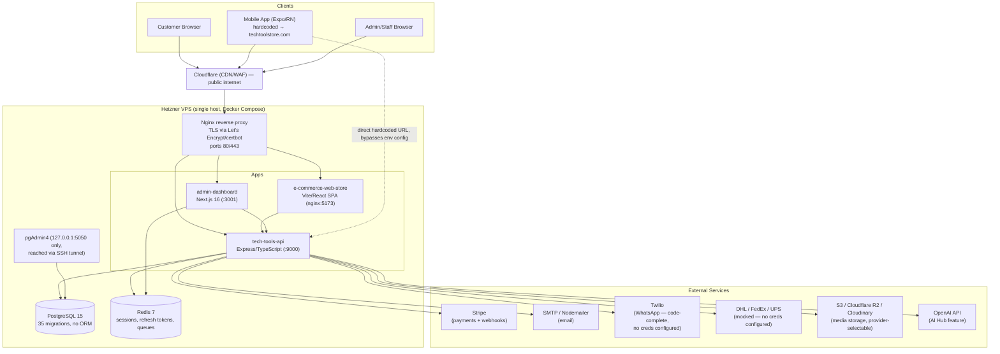
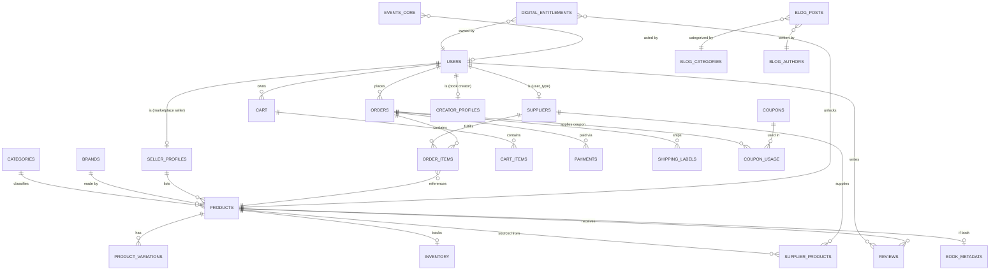

# TechTools — Complete Read-Only Project Audit

**Date:** 2026-07-31
**Scope:** Full repository at `/home/mukulah/Enterprise-Grade-E-commerce` (read-only inspection; no code modified, no destructive commands run, no secret values reproduced).
**Method:** Static code/config review across all workspaces (`tech-tools-api`, `admin-dashboard`, `e-commerce-web-store`, `tech-tools-mobile-app`, `infra/`, `infrastructure/`, `docs/`, `scripts/`, `server-scripts/`). Where something could not be confirmed from the repository alone, it is explicitly marked **Not verified**.

---

## PART 1 — EXECUTIVE SUMMARY

**What TechTools currently is:** a genuinely large, actively-developed, single-tenant e-commerce codebase — not a toy demo. It is a monorepo containing four real applications (a Node/Express API, a Next.js admin dashboard, a Vite/React storefront, and an Expo/React Native mobile app) sharing one PostgreSQL database, plus a substantial amount of production DevOps tooling (Docker Compose stacks, Nginx configs, firewall scripts, backup scripts, and 30+ pages of internal deployment documentation). It already appears to be deployed on a Hetzner VPS behind Cloudflare (see Part 11), and the mobile app has an Android App Bundle built for Play Store internal testing (see Part 10).

**Applications and services that exist:**
| App | Path | Framework | Role |
|---|---|---|---|
| Backend API | `tech-tools-api/` | Node.js + Express + TypeScript, raw `pg` (no ORM) | Single source of truth for all data/business logic |
| Admin Dashboard | `admin-dashboard/` | Next.js 16 (App Router), React 19 | Internal staff/admin console |
| Customer Storefront | `e-commerce-web-store/` | Vite + React + TypeScript | Public-facing shop |
| Mobile App | `tech-tools-mobile-app/` | Expo SDK 55 / React Native 0.83 | iOS/Android shopping app, already has a Play Store listing URL configured |

**What is genuinely functional (real, backend-wired, not mocked):** authentication (JWT + bcrypt + account lockout + email verification + password reset), product/category/brand/variant CRUD, orders (including guest checkout), Stripe payments and refunds, coupons/discounts engine, reviews backend, blog CMS, supplier and seller/marketplace subsystems, newsletter/email/WhatsApp messaging infrastructure, analytics event pipeline, and a "creator/books/digital library" subsystem (ebooks, digital entitlements, even Web3/NFT metadata fields) that goes well beyond a typical e-commerce starter.

**What is partially implemented:** shipping carrier integrations (DHL/FedEx/UPS code exists but silently falls back to mocked rates/tracking because no carrier credentials are configured — Part 8); WhatsApp/Twilio messaging (code-complete, no credentials found in env files); RBAC (roles exist in the database and are enforced on the backend for admin routes, but the admin dashboard itself has no server-side route guard — only a client-side redirect, Part 12); server-side cart (no persisted cart table — checkout trusts client-submitted item arrays, Part 5/12).

**What is demonstration-only, mocked, or hard-coded:** in the customer storefront — product reviews, order history, and order tracking are 100% hardcoded/mock UI despite real backend endpoints existing for all three (Part 7); in the admin dashboard — the "Admin Users" and "Media Library" pages are static placeholders with no API wiring (Part 7); seed data includes demo products, demo admin credentials with a placeholder bcrypt hash, and sample coupon codes (Part 7).

**Is it production-ready?** **No, not for accepting real customer money today**, but it is much closer than a typical MVP. The single most serious blocker is a likely-broken Stripe webhook signature verification caused by Express body-parser ordering (Part 12, Critical) — if real, this means payment confirmations may not be processed reliably. Combined with the storefront's fake order-tracking/order-history pages and missing legal/compliance features (EU VAT, GPSR, withdrawal-rights, no cookie consent banner — Part 7/8), the platform is **not legally or operationally ready for real EU consumer transactions** without a focused remediation sprint.

**Strongest commercial use case, given what exists today:** the codebase is disproportionately more sophisticated as **e-commerce platform software** than as a single store's content. The supplier/seller/marketplace tables, RBAC, coupon engine, analytics pipeline, and even embryonic multi-seller "creator" economy suggest the highest-leverage path is **not** "sell woodworking tools" as the end goal, but rather to use TechTools as the working reference implementation for a **productized e-commerce service** (managed hosting, white-label storefronts, or a dropshipping operation) — see Part 14/16 for the full argument.

---

## PART 2 — REPOSITORY STRUCTURE

```
Enterprise-Grade-E-commerce/
├── package.json                    # npm workspaces root: tech-tools-api, admin-dashboard, e-commerce-web-store
├── .env / .env.example             # shared root-level secrets template (DB, Redis, JWT, SMTP, AWS, Stripe-adjacent)
├── docs/                            # 18 internal runbooks + docs/exstra-docs/ (14 more)
├── infra/scripts/                  # firewall + Cloudflare IP allow-list scripts (host-level security)
├── infrastructure/                 # PRIMARY prod/dev Docker Compose stack + nginx + pgadmin config
│   ├── docker-compose.prod.yml     # postgres, redis, api, admin-dashboard, web-store, nginx, pgadmin, certbot
│   ├── docker-compose.dev.yml
│   ├── nginx/                      # prod.conf — TLS, HSTS, CSP, Cloudflare-aware headers
│   └── pgadmin/
├── scripts/                        # LOCAL operator scripts (SSH into the Hetzner box): deploy.sh, backup.sh,
│                                    #   restart.sh, status.sh, logs.sh, cleanup.sh, pgadmin-tunnel.sh, local-backup.sh (Restic)
├── server-scripts/                 # SERVER-SIDE scripts run as root on the VPS: pull.sh, update.sh, migrate.sh,
│                                    #   seed.sh, backup-db.sh, restore-db.sh, ops-maintenance.sh, nginx-reload.sh
├── tech-tools-api/                 # BACKEND — Node/Express/TypeScript REST API (source of truth)
│   ├── src/
│   │   ├── api/v1/                 # 30 route groups: auth, admin, products, orders, payments, shipping,
│   │   │                           #   suppliers, seller, creator, books, blog, coupons, reviews, newsletter,
│   │   │                           #   emails, whatsapp, analytics, alerts, ai, notifications, settings, users...
│   │   ├── database/
│   │   │   ├── migrations/         # 35 hand-written .sql files (001 → 035), custom runner, no ORM
│   │   │   └── seeds/              # sample categories/products/brands/blog + create-super-admin.ts (interactive)
│   │   ├── middleware/              # auth.ts (JWT + RBAC), validation.ts (Joi), errorHandler.ts
│   │   ├── services/                # stripe, email, whatsapp, coupon, review, websocket, supplier.guardrails,
│   │   │                           #   shipping/carriers/{dhl,fedex,ups}.ts, notification-dispatcher, newsletter.queue
│   │   ├── workers/                 # anomaly.detection.ts, metrics.broadcaster.ts (background cron-style jobs)
│   │   ├── app.ts / index.ts        # Express app assembly + server bootstrap
│   │   ├── Dockerfile               # multi-stage, non-root user, HEALTHCHECK on /health
│   │   ├── nginx/, infra/           # a SECOND, parallel Docker/nginx stack (see Part 11 — clarify which is live)
│   │   ├── postman/                 # 4 versions of a hand-maintained API collection (v1→v3-Enterprise)
│   │   └── coverage/                # last-generated Jest coverage report (~25-50% depending on metric)
├── admin-dashboard/                 # ADMIN CONSOLE — Next.js 16 App Router
│   ├── app/(dashboard)/             # products, blog, books, brands, categories, collections, sellers, suppliers,
│   │                                #   trending, newsletter, email, whatsapp, contact, ai-hub, dashboard/{orders,
│   │                                #   customers, reviews, coupons, analytics, admins*, media*, settings}
│   │                                #   (* = static placeholder pages, not wired to API — see Part 7)
│   ├── services/                    # one thin API-client wrapper per domain, calling tech-tools-api
│   ├── contexts/AuthContext.tsx + lib/auth-store.ts   # TWO PARALLEL auth stores (see Part 12)
│   ├── nginx/, Dockerfile, Dockerfile.dev, docker-compose.yml
├── e-commerce-web-store/            # STOREFRONT — Vite + React + TypeScript SPA
│   ├── src/api/index.ts             # single axios client (Stripe key fetched at runtime, not baked in)
│   ├── src/pages/                   # ProductDetailPage, OrdersPage*, TrackOrderPage*, CheckoutPage (real),
│   │                                #   CreatorDashboardPage, SellerHubPage  (* = mock/hardcoded, see Part 7)
│   ├── src/stores/                  # cartStore, wishlistStore (wishlist is local-only, never synced)
│   ├── dist/                        # committed build output (should not be in version control)
│   ├── Dockerfile (nginx runner), nginx.conf
├── tech-tools-mobile-app/           # MOBILE — Expo SDK 55 / React Native 0.83 / expo-router
│   ├── src/app/                     # file-based routes: (auth), (tabs), product, checkout, orders, profile/seller
│   ├── src/api/index.ts             # HARDCODED prod API URL (https://techtoolstore.com/api/v1), no env switch
│   ├── eas.json                     # build/submit profiles; Stripe publishable keys committed literally
│   ├── techtools-v13.aab            # a committed 65MB Android App Bundle (should not be in git)
│   ├── google-services.json (tracked, safe/public per Firebase convention)
│   └── google-service-account.json (present locally, correctly gitignored, never committed)
└── .github/workflows/                # ONLY 2 workflows exist:
    ├── mobile-app-ci-cd.yml          #   lint + EAS OTA update + Play Store build/submit
    └── web-store-performance-ci.yml  #   bundle-size budget check only
                                       #   (NO CI exists for tech-tools-api or admin-dashboard)
```

**Folder responsibilities, tech, entry points, and inter-service communication:**

- **`tech-tools-api/`** — Express 4 + TypeScript on Node, PostgreSQL 15 via raw `pg` (no ORM/Prisma — schema managed by hand-written SQL migrations and a custom runner at `tech-tools-api/src/database/migrate.ts`). Entry point `src/index.ts` → `src/app.ts`. Talks to Postgres, Redis (sessions/refresh tokens/queues), Stripe, SMTP, Twilio (WhatsApp, unconfigured), and S3/R2/Cloudinary for media. All other apps depend on this service exclusively for data.
- **`admin-dashboard/`** — Next.js 16, calls `tech-tools-api` via `NEXT_PUBLIC_API_URL`/`API_INTERNAL_URL` (`admin-dashboard/lib/api-client.ts:7-12`). Has its own Redis instance for dashboard session/cache use (separate from the API's Redis). Runs on port 3001 in dev; Docker service name `admin-dashboard`.
- **`e-commerce-web-store/`** — Vite/React SPA, calls `tech-tools-api` via `VITE_API_URL`; served in production by an nginx container listening on port 5173 internally.
- **`tech-tools-mobile-app/`** — Expo app, calls `tech-tools-api` via a **hardcoded** production URL (not env-driven — a notable technical-debt item, see Part 10).
- **`infrastructure/`** — the primary/authoritative Docker Compose + nginx stack that fronts all three web apps behind a single reverse proxy with TLS (Let's Encrypt via certbot) and Cloudflare-aware headers.
- **`scripts/` vs `server-scripts/`** — a deliberate split between commands run from the developer's laptop (which SSH out to the server) and commands meant to run locally on the VPS itself.
- **`docs/`** — the most extensive documentation set observed in a project this size: dedicated security-hardening, production-deployment, and sprint-completion documents already exist (see Part 11).

---

## PART 3 — SYSTEM ARCHITECTURE

**Confirmed deployment shape:** single Hetzner VPS (~$20/month per `docs/SECURITY-ARCHITECTURE.md:490`), Docker Compose (no Kubernetes/Swarm), Cloudflare in front of ports 80/443, UFW firewall restricting 80/443 to Cloudflare's published IP ranges (SSH/22 open to all — see Part 12), Let's Encrypt via certbot with a self-signed fallback on first boot.

**Application/port map (from `infrastructure/docker-compose.prod.yml` and app-level Dockerfiles):**

| Service | Internal port | Exposed via | Notes |
|---|---|---|---|
| `nginx` | 80/443 | Public (Cloudflare only) | Single reverse-proxy entry point, TLS termination |
| `api` (tech-tools-api) | 9000 | via nginx `/api/` | Express app, `/health` and `/api/v1/health` endpoints |
| `admin-dashboard` | 3001 (3000 referenced inconsistently in one nginx upstream — Part 12) | via nginx, admin subdomain | Next.js standalone build |
| `web-store` | 5173 | via nginx | nginx-served static Vite build |
| `postgres` | 5432 | internal Docker network only | postgres:15-alpine |
| `redis` | 6379 | internal Docker network only | redis:7-alpine, password-protected |
| `pgadmin` | 5050 | `127.0.0.1` only (SSH tunnel via `scripts/pgadmin-tunnel.sh`) | Not publicly exposed — good practice |
| `certbot` | — | — | Renews Let's Encrypt certs |

**Domain:** `techtoolstore.com` is the confirmed production domain (referenced in the mobile app's hardcoded API URL, nginx CSP config, and Terms/Privacy links). Admin subdomain configuration references `admin.techtools.local` in one nginx dev config (`admin-dashboard/nginx/conf.d/admin.conf`) — **the real admin production domain is Not verified** from the repo alone.

### Mermaid Architecture Diagram



---

## PART 4 — TECHNOLOGY INVENTORY

| Component | Language/Framework | Version | Purpose | Location | Production Status |
|---|---|---|---|---|---|
| Backend API | Node.js + Express + TypeScript | Express 4.18.2, TS ~5 | Core REST API, all business logic | `tech-tools-api/` | Functional, some gaps (Part 12) |
| Database driver | `pg` (node-postgres), no ORM | `pg` 8.11 | Raw SQL access | `tech-tools-api/src/database/` | Functional; ad hoc migrations |
| Database engine | PostgreSQL | 15 (postgres:15-alpine) | Primary datastore | Docker service `postgres` | Functional |
| Cache/session store | Redis | 7 (redis:7-alpine) | Refresh tokens, queues, dashboard cache | Docker services `redis`, `admin-redis` | Functional |
| Admin Dashboard | Next.js (App Router) + React | Next 16, React 19.2.3 | Internal admin console | `admin-dashboard/` | Functional, 2 placeholder pages |
| Storefront | Vite + React + TypeScript | React 19 (Not verified exact) | Customer-facing shop | `e-commerce-web-store/` | Functional core, mocked reviews/orders/tracking |
| Mobile App | Expo (React Native) | Expo SDK 55, RN 0.83.6, React 19.2.0 | iOS/Android app | `tech-tools-mobile-app/` | Functional, Android internal-testing build exists |
| Reverse proxy | Nginx | alpine | TLS termination, routing, rate limiting | `infrastructure/nginx/`, per-app `nginx/` | Functional |
| Containerization | Docker + Docker Compose | — | All services | `infrastructure/docker-compose.*.yml`, per-app Dockerfiles | Functional; two parallel API-level stacks (Part 11) |
| Payments | Stripe SDK | `stripe` 17.7.0 | Payment intents, refunds, webhooks | `tech-tools-api/src/services/stripe.service.ts` | Functional, webhook signature verification likely broken (Part 12) |
| Payments (secondary) | PayPal | — | Declared env vars only | `.env.example` | **Not integrated** — no SDK, no code references |
| Email | Nodemailer (SMTP) | 8.0.2 | Transactional + newsletter email | `tech-tools-api/src/services/email.service.ts` | Functional (SMTP creds required) |
| WhatsApp/SMS | Twilio SDK | 6.0.2 | WhatsApp messaging | `tech-tools-api/src/services/whatsapp.service.ts` | Code-complete, **no credentials found configured** |
| Shipping | Custom carrier adapters | — | DHL/FedEx/UPS rates & tracking | `tech-tools-api/src/services/shipping/carriers/` | Code-complete, **operating in mock mode** (no DB-stored credentials) |
| Media storage | AWS S3 SDK / Cloudflare R2 / Cloudinary | `@aws-sdk/client-s3` 3.350.0 | Product/media assets | `tech-tools-api/src/utils/media.ts`, env `MEDIA_STORAGE_PROVIDER` | Functional, provider-selectable |
| Analytics | Custom event pipeline | — | `events_core`, hourly aggregates, alerts | `tech-tools-api/src/api/v1/analytics/` | Functional |
| Real-time | Socket.IO | 4.8.3 | Live metrics/alerts to admin dashboard | `tech-tools-api/src/services/websocket.service.ts`, `admin-dashboard/hooks/useRealtimeMetrics.ts` | Functional in API; **broken env var on dashboard client** (Part 6) |
| AI features | OpenAI API | — | "AI Hub" draft/orchestrator | `tech-tools-api/src/api/v1/ai/`, migration `021_ai_orchestrator.sql` | Functional (human-in-the-loop approval queue) |
| Logging | Winston | 3.9.0 | Structured logs | `tech-tools-api/src/utils/logger.ts` | File logs disabled in production (console/Docker logs only) |
| Testing (API) | Jest + ts-jest + Supertest | 29.5.0 | Unit/integration tests | `tech-tools-api/*.test.ts` (5 files) | Partial (~25-50% coverage, concentrated in a few modules) |
| Testing (others) | — | — | — | admin-dashboard, storefront, mobile | **None found** |
| CI/CD | GitHub Actions | — | Mobile build/OTA + web bundle-budget only | `.github/workflows/` | **No CI for API or admin dashboard** |
| API documentation | Postman collections (4 versions) | — | Manually maintained API reference | `tech-tools-api/postman/` | Functional but manual; Swagger dependency present but disabled in code |

---

## PART 5 — DATABASE STRUCTURE

**Engine:** PostgreSQL 15. **No ORM** — schema is defined entirely by 35 hand-written SQL migration files under `tech-tools-api/src/database/migrations/` (`001_initial_schema.sql` → `035_creator_audit_logs.sql`), applied by a custom TypeScript/bash runner. There is **no rollback SQL** for any migration — `down` only removes the tracking-table row and requires manual cleanup.

### Key Models

**`users`** — single table for customers, suppliers, admins, and super admins (discriminated by `user_type`). `password_hash` (bcrypt), `stripe_customer_id`, `failed_login_attempts`/`locked_until` (brute-force lockout), soft-delete via `deleted_at`. **Risk:** two overlapping `CHECK` constraints on `user_type` — a later migration (`002`) effectively drops `'supplier'` as a valid value even though the `suppliers` table still references `users`.

**Admin RBAC** (`002_admin_management_schema.sql`) — `admin_activity_logs`, `admin_permissions`, `admin_role_permissions`, `admin_invitations`, `admin_sessions`, `admin_two_factor` (TOTP secret + backup codes stored with **no documented encryption-at-rest flag**). **No standalone `admins` table exists** — yet migration `026` references `admins(id)` as a foreign key target, which appears to be a genuine bug (see below).

**`suppliers`** — dropship partner accounts; `api_key VARCHAR(500)` stored **in plaintext with no encryption flag**, inconsistent with `email_aliases.smtp_pass_encrypted` elsewhere in the same schema. `reliability_score`, `on_time_rate`, `defect_rate`, `refund_rate` — a genuinely useful dropshipping data model already exists.

**`seller_profiles`** (migration `034`) — a **second, parallel** seller concept (marketplace/creator sellers with tiers: unverified/basic/trusted/pro, commission config, verification workflow) that does not FK-link to `suppliers` — two overlapping business models coexist without consolidation.

**`products`** — `sku`/`slug` unique, `base_price`/`sale_price`/`cost_price` all `DECIMAL(10,2)` (correct practice, not float), `product_kind` (`physical`/`digital`/`book`/`service`), `publication_status` workflow, soft-delete. **Risk:** `products.stock_quantity` (added migration `012`) duplicates the separate `inventory.current_stock`/`reserved_stock` table with no visible sync trigger — two sources of truth for stock.

**`inventory`** — `available_stock` is a `GENERATED ALWAYS AS (current_stock - reserved_stock) STORED` computed column (good practice). No CHECK preventing `reserved_stock > current_stock`.

**`cart` / `cart_items`** — exists as tables, but the API layer has **no dedicated cart controller/service** — checkout accepts a client-submitted `items` array directly rather than reading from a server-authoritative cart (see Part 12, price-integrity risk).

**`orders` / `order_items`** — `order_number` unique, supports guest checkout (nullable `user_id` + `guest_email` columns added migration `019`), JSONB shipping/billing address snapshots, generated `total_price` column on line items. **No `orders.user_id` explicit `ON DELETE` action** (inconsistent with the rest of the schema).

**`payments`** — Stripe integration columns (migration `013`), idempotent `stripe_webhook_events` table. **No dedicated `refunds` table** — refunds are tracked only as `refund_amount`/`refund_reason` columns on `payments`, so multiple partial refunds against one payment cannot be tracked distinctly.

**`shipping_carriers` / `shipping_labels` / `shipping_zones` / `shipping_tracking_history`** — a real, DB-driven shipping configuration system exists (migration `005`), but `shipping_carriers.credentials JSONB` has **no encryption flag**, and the table is empty by default, which is why the carrier adapters fall back to mock data (Part 8).

**`coupons` / `coupon_usage` / `user_coupons`** — full discount engine (percentage/fixed/free-shipping/BOGO). **No DB-level enforcement of `usage_limit_per_user`** — no unique constraint on `(coupon_id, user_id)`, so this can only be enforced in application code.

**Email/WhatsApp/Newsletter** — `email_messages`, `email_templates`, `email_aliases` (SMTP creds, explicitly named `smtp_pass_encrypted`), `whatsapp_messages`/`whatsapp_settings`/`whatsapp_templates`, `newsletter_subscribers`, `newsletter_campaigns` (recreated once already to fix a broken FK — see below), A/B testing and conversion-tracking tables (migrations `022`–`024`).

**Media** — `product_media`/`category_media` (CDN-ready, with a trigger enforcing a single primary image), plus a **legacy** `product_images` table that appears to overlap with `product_media` without a clear deprecation marker.

**Analytics** — `events_core` (unified event stream), `user_sessions`, `event_aggregates_hourly`, `alerts` (anomaly detection — contains the broken `admins(id)` FK, see below), `contact_analytics`.

**Blog** — full CMS: posts, categories, tags, authors, comments (supports guest comments), likes, views, series, full-text search index. Genuinely complete.

**Books / Digital Library / "Web3"** — `creator_profiles`, `book_metadata` (ISBN, DRM flag), `web3_book_assets` (NFT/blockchain metadata: chain ID, contract address, royalty basis points), `digital_assets`/`digital_entitlements`/`reading_progress` (idempotent entitlement grants), `creator_audit_logs` (**immutable** — enforced via PostgreSQL `RULE`s blocking UPDATE/DELETE, a genuinely strong practice).

**Reviews** — `reviews` (rating 1–5, `UNIQUE(product_id, user_id, order_item_id)` prevents duplicate reviews per purchase), `review_images`, `review_votes`, `review_responses`, cached `product_review_summary`.

### Confirmed Schema Bugs (data-consistency risk)

1. **`alerts.acknowledged_by REFERENCES admins(id)`** (migration `026`) — no `admins` table exists anywhere in the migration history. This migration would fail against a fresh database unless resolved manually out-of-band. **Not verified** whether the live database has a manual workaround.
2. **`newsletter_campaigns.created_by REFERENCES admin_users(id)`** in migration `016` referenced a table that was never created — the bug was caught and patched by migration `017`, which dropped the FK entirely. This is direct evidence that at least one migration reached a live/shared database in a broken state before being fixed.
3. Duplicate/conflicting `user_type` CHECK constraints (see `users` above).
4. Duplicate stock-tracking sources of truth (`products.stock_quantity` vs `inventory`).
5. Duplicate product-media tables (`product_images` legacy vs `product_media` current).

### Simplified Entity-Relationship Diagram



---

## PART 6 — FEATURE STATUS MATRIX

| Feature | Status | Evidence |
|---|---|---|
| Registration/login | **Production-ready** | `tech-tools-api/src/api/v1/auth/auth.controller.ts:16-283` — bcrypt, JWT, account lockout after 5 attempts |
| Email verification | **Production-ready** | `auth.controller.ts:378-420` — Redis-backed token, 24h TTL |
| Password recovery | **Production-ready** | `auth.controller.ts:431-516` — non-enumerating, invalidates refresh tokens on reset |
| Admin authentication | **Functional but incomplete** | Backend RBAC solid (`admin.routes.ts:29`), but admin-dashboard client has **no server-side route middleware**, only client-side redirect (`admin-dashboard/app/(dashboard)/layout.tsx:14-20`) |
| Role-based access control | **Functional but incomplete** | Backend enforces `authorize()` per-route; admin-dashboard UI does not hide nav by role and has two unsynced auth stores (`contexts/AuthContext.tsx` + `lib/auth-store.ts`) |
| Product management | **Production-ready** | Full CRUD, bulk ops, variations, media — `tech-tools-api/src/api/v1/products/product.controller.ts` (1379 lines); admin UI wired via `productService` |
| Inventory | **Functional but incomplete** | `inventory` table with generated `available_stock`, but duplicated by `products.stock_quantity` with no sync (Part 5) |
| Cart | **Functional but incomplete** | `cart`/`cart_items` tables exist; mobile/storefront cart stores work client-side; **no server-authoritative cart** validated at checkout |
| Checkout | **Functional but incomplete** | Real Stripe PaymentElement flow (`CheckoutPage.tsx`, `checkout.tsx` mobile) but relies on client-submitted item/price data (Part 12) |
| Payments | **Functional but incomplete** | Stripe integration is real and comprehensive, but webhook signature verification is likely broken due to body-parser ordering (Part 12, Critical) |
| Orders | **Production-ready (backend)** | `order.controller.ts` (1523 lines) — customer + guest + full admin order management |
| Refunds | **Functional but incomplete** | Real Stripe refund + admin UI, but no dedicated `refunds` table (only columns on `payments`) — can't track multiple partial refunds |
| Customer accounts | **Production-ready** | Profile, addresses, payment methods, notifications all real and API-wired (mobile + storefront) |
| Coupons | **Production-ready** | `coupon.service.ts` (657 lines) — percentage/fixed/free-shipping/BOGO, expiry sweep, admin UI real |
| Shipping | **Mocked** | Real carrier adapter code (DHL/FedEx/UPS) but **no credentials configured**, so rates/tracking are hard-coded mock responses (`tech-tools-api/src/services/shipping/carriers/dhl.ts:103,220-300`) |
| Tracking | **Broken/Mocked** | Backend tracking-history table exists, but storefront's `TrackOrderPage.tsx:42-117` **ignores user input and always shows fabricated mock tracking data** |
| Sellers | **Functional but incomplete** | `seller_profiles`, verification workflow, admin approval queue all real; storefront `SellerHubPage.tsx` uses a separate hardcoded `$`-based formatter (currency inconsistency) |
| Suppliers | **Functional but incomplete** | Real CRUD + profitability guardrails backend; no supplier-facing portal found (admin-managed only) |
| Marketplace | **Functional but incomplete** | Two parallel seller/supplier data models exist without consolidation (Part 5) |
| Email | **Functional** | Nodemailer/SMTP real, contingent on SMTP credentials being set at deploy time |
| WhatsApp | **Mocked/Unconfigured** | Code-complete Twilio integration, but no `TWILIO_*`/`WHATSAPP_*` credentials found in any `.env`/`.env.example` |
| Newsletter | **Production-ready** | Queue worker, A/B testing, deliverability guardrails, conversion tracking — a mature subsystem |
| Blog | **Production-ready** | Full CMS with comments, likes, views, full-text search — both backend and admin UI real |
| Books | **Functional but incomplete** | Real digital-library/entitlement/DRM schema and creator workflow; commercial go-to-market unclear (Web3/NFT fields present but usage is speculative) |
| Media library | **UI only / Broken** | Admin-dashboard "Media Library" page is a static placeholder — "Select Files" button has no `onClick`, all counts hardcoded to 0 (`admin-dashboard/app/(dashboard)/dashboard/media/page.tsx:21-76`) despite a real `mediaService` existing and being used elsewhere |
| Analytics | **Production-ready (backend)** | Real event pipeline, revenue trend, conversion funnel, refund/return rate metrics |
| Mobile app | **Functional but incomplete** | Most core shopping flows real and Stripe-integrated; push-token registration likely broken (Part 10); hardcoded prod API URL |
| Notifications | **Functional but incomplete** | Multi-channel dispatcher (email/SMS/Slack/websocket) real on backend; mobile push-token registration bug (Part 10) |
| Search | **Functional but incomplete** | Basic SQL `ILIKE` substring search only — no full-text/Elasticsearch; adequate for a small catalog only |
| Reviews | **Broken (storefront) / Production-ready (backend)** | Full backend moderation/voting/response system exists and is used by the admin dashboard, but the **storefront always renders 3 fake hardcoded reviews for every product** (`ProductDetailPage.tsx:369,602-679`) instead of calling the real `reviewsApi` |
| GDPR/cookies | **Not implemented** | Privacy/Terms/Cookie policy pages exist as static text, but **no cookie-consent banner component exists anywhere** in the storefront (`e-commerce-web-store/src/App.tsx` — confirmed absent) |
| Backups | **Functional (manual)** | `server-scripts/backup-db.sh` (pg_dump, keeps 30), `scripts/backup.sh` (pulls to local machine), `scripts/local-backup.sh` (Restic) — all script-triggered, **no evidence of automated/scheduled backups verified from the repo** beyond a documented cron reference (Not verified whether the cron is actually installed on the live server) |
| Admin Users management | **UI only / Broken** | `admin-dashboard/app/(dashboard)/dashboard/admins/page.tsx` — entirely static, one hardcoded fake admin row, no API calls at all |

---

## PART 7 — REAL VS DEMONSTRATION DATA

**Confirmed fake/hardcoded content that must be removed or fixed before accepting real customers:**

1. **Product reviews (storefront)** — `e-commerce-web-store/src/pages/ProductDetailPage.tsx:369,515,599,602-679` renders a fixed "4.5/5 (128 reviews)" and three identical canned reviews ("Customer 1/2/3... Great product! Exactly as described...") for **every product on the site**, regardless of what real reviews exist in the `reviews` table. The real `reviewsApi` client exists and is unused.
2. **Order history (storefront)** — `OrdersPage.tsx:24-93` is a `const mockOrders = [...]` array with Unsplash stock photos; the real order API (`ordersApiNew`) used elsewhere in checkout is never called here.
3. **Order tracking (storefront)** — `TrackOrderPage.tsx:42-117` returns a hardcoded fake tracking number (`7489374893748937`) and status **regardless of what the customer types into the tracking form**. This is the single most customer-facing "looks complete but does nothing real" feature in the codebase.
4. **Wishlist (storefront)** — persisted only to `localStorage`, never synced server-side, despite a real `wishlistApi` existing.
5. **Admin dashboard "Media Library" and "Admin Users" pages** — entirely static placeholder screens (Part 6).
6. **Seed data** — `tech-tools-api/src/database/seeds/` and `server-scripts/seed.sh` insert demo categories, ~25 sample products, sample blog posts, and a demo admin account. `server-scripts/seed.sh:414` inserts a seed admin (`admin@techtools.com`) with a literal placeholder string `'$2b$10$dummyhashforseeding'` in place of a real bcrypt hash — this is a non-functional placeholder (cannot be used to log in) but should still be purged before go-live to avoid confusion.
7. **Sample coupon codes** — `WELCOME10`, `SAVE20` inserted by migration `006` — fine as templates, must be reviewed/replaced with real promotional terms before launch.
8. **Currency inconsistency** — the canonical price formatter defaults to EUR (`e-commerce-web-store/src/utils/index.ts:14-27`) and is used on most pages, but `CreatorDashboardPage.tsx:40`, `SellerHubPage.tsx:31`, and `SupportConcierge.tsx:301` each define their own **hardcoded `$`-prefixed** formatter, and `TermsOfServicePage.tsx:156` explicitly states "All prices are displayed in USD" — directly contradicting the EUR pricing shown throughout the actual shopping experience. This must be unified before any EU launch.
9. **Sandbox vs live payment keys** — **Not verified** from the repo which mode (`sk_test_...` vs `sk_live_...`) the deployed `STRIPE_SECRET_KEY` is currently in; this must be confirmed operationally before real transactions, and the webhook-verification bug (Part 12) must be fixed regardless of mode.
10. **Mock shipping carriers** — DHL/FedEx/UPS integrations return fabricated rates/tracking whenever carrier credentials aren't present in the `shipping_carriers` table (Part 8) — currently this is the default state.
11. **AAB build artifact and literal Stripe keys committed to the mobile repo** — `tech-tools-mobile-app/techtools-v13.aab` (65MB) and Stripe publishable keys (test **and** live) are committed as plaintext values in `eas.json:9,41` — publishable keys are designed to be client-visible so this isn't a secret leak, but committing literal values instead of referencing EAS environment variables is bad practice for key rotation.

**What looks complete in the UI but has no working backend wiring:** reviews, order history, and order tracking on the storefront (items 1-3 above) are the clearest examples — each has a fully-built, real backend endpoint that the frontend simply doesn't call.

---

## PART 8 — DROPSHIPPING READINESS

Assessment for operating as a real European woodworking/construction-tools dropshipping business:

| Requirement | Status | Evidence |
|---|---|---|
| Multiple suppliers | **Supported** | `suppliers` table, admin CRUD, `source_platform` (amazon/alibaba/other) |
| Supplier-specific SKUs | **Supported** | `supplier_products` junction table with its own `cost_price`, per-supplier stock |
| Wholesale vs retail prices | **Supported** | `products.cost_price` vs `base_price`/`sale_price`, plus `product_unit_economics` (migration `025`) |
| Supplier stock feeds (CSV/XML/API import) | **Not found** | No import/feed-parsing code found in `tech-tools-api/src/services` or `src/api/v1/suppliers` beyond manual admin CRUD — `syncSupplierProducts` endpoint exists but its actual data source (manual vs automated feed) is **Not verified** without reading its full implementation |
| Automatic stock synchronisation | **Not implemented** | No scheduled job or webhook consumer for supplier stock updates was found; `products.stock_quantity` vs `inventory` duplication (Part 5) would need resolving before this could work reliably anyway |
| Supplier order routing / split orders | **Partially supported** | `order_items.supplier_id` exists, so an order can reference which supplier fulfills each line — but no automated "notify supplier / generate purchase order" workflow was found |
| Supplier shipping costs | **Data model exists** | `supplier_products` has cost fields; end-to-end shipping-cost-to-customer calculation not verified |
| Product lead times | **Not found** | No lead-time field located in `products` or `supplier_products` |
| Neutral packing slips (no supplier branding, for dropshipping) | **Not implemented** | No packing-slip/invoice generation code found at all |
| Returns and warranties | **Partially supported** | `refund_amount`/`refund_reason` on payments; no dedicated returns/RMA workflow or warranty-tracking table found |
| Purchase orders | **Not implemented** | No `purchase_orders` table or related endpoints found |
| Margin calculation | **Supported** | `product_unit_economics`, `product_operational_flags`, supplier scoring (`reliability_score`, `on_time_rate`, `defect_rate`) — genuinely more sophisticated than most starter e-commerce codebases |
| Product compliance records (CE marking, materials, etc.) | **Not implemented** | No compliance/certification fields found on `products` |
| EU VAT (rate by country, invoicing) | **Not implemented** | No VAT-rate table, no VAT-inclusive/exclusive pricing logic, no invoice-numbering sequence found anywhere in `tech-tools-api` |
| EU consumer 14-day withdrawal right | **Not implemented** | No returns-window logic or customer-facing withdrawal workflow found |
| Two-year legal guarantee (EU Consumer Sales Directive) | **Not implemented** | No warranty-period tracking found |
| GDPR (data export/erasure, consent) | **Partially supported** | Soft-delete (`deleted_at`) exists on `users` (useful for erasure), but **no cookie-consent banner**, no user-facing "export my data" or "delete my account" self-service endpoint was found in the reviewed controllers |
| GPSR / product-safety information | **Not implemented** | No product-safety-document fields or manufacturer-responsible-person data model found |

**Bottom line:** the *commercial/operational* data model for dropshipping (suppliers, margins, order routing) is unusually mature for a project this size — clearly more thought went into supplier economics than into legal compliance. **The legal/compliance layer (VAT, withdrawal rights, warranty, GPSR, GDPR self-service, cookie consent) is almost entirely missing** and is the single biggest gap before this could legally sell to EU consumers. None of this is a small add-on — expect a dedicated compliance workstream (see Part 15, P0).

---

## PART 9 — WHITE-LABEL SAAS READINESS

| Requirement | Status | Evidence |
|---|---|---|
| Tenant isolation | **Not implemented** | Single shared database, single shared codebase deployment — no `tenant_id` column found on any table |
| Branding configuration | **Not implemented** | Colors/name hardcoded (`tech-tools-mobile-app/src/constants/appTheme.ts:5-51` — literal hex values, no config layer); admin dashboard and storefront similarly assume one brand |
| Custom domains | **Not implemented** | Single nginx vhost per app, single hardcoded domain (`techtoolstore.com`) referenced directly in mobile app source |
| Currency/language configuration | **Not implemented** | Currency is hardcoded/inconsistent even within one deployment (Part 7); no i18n framework found |
| Per-customer environment variables | **N/A (no multi-tenant runtime)** | Env vars are per-deployment, not per-tenant |
| Separate databases per customer | **N/A** | Would require running a separate stack per customer today — see recommendation below |
| Subscription billing (for SaaS customers, not shop customers) | **Not implemented** | Stripe integration exists but is wired for one-time product checkout, not recurring platform-subscription billing |
| Usage limits / plan tiers | **Partially analogous** | `seller_tier_config` (migration `034`) implements tiered limits for *marketplace sellers within one store* — this is conceptually reusable for a SaaS plan-tier system but is not currently generic/tenant-aware |
| Automated provisioning | **Not implemented** | All deployment is manual/SSH-driven (Part 11); no one-click "spin up a new customer stack" tooling exists |
| Backups (per tenant) | **Not implemented** | Current backup scripts back up the single shared database, not per-tenant |
| Monitoring | **Minimal** | Only Docker healthchecks + manual `status.sh` scripts; no APM/alerting SaaS integrated |
| Customer suspension | **Partially analogous** | `seller_profiles.is_suspended` exists for marketplace sellers, not for platform-level tenant suspension |
| Customer data export/deletion | **Not implemented** | No tenant-level export/delete tooling; only per-user soft-delete |

**Recommendation: Option A — one isolated Docker deployment per customer**, at least initially.

Reasoning: the codebase has **zero tenant-isolation code** (no `tenant_id`, no per-request tenant resolution, no shared-schema multi-tenancy pattern anywhere in the 35 migrations). Retrofitting true shared multi-tenancy (Option B) would require touching almost every table and every query — a very large, risky undertaking for a solo founder. By contrast, the existing Docker Compose + Nginx + environment-variable configuration (Part 11) is **already structured per-deployment** — spinning up a second isolated stack (new compose project, new `.env`, new subdomain, new Postgres/Redis) on the same or a second VPS is mechanically straightforward with what already exists, even though it's currently manual. A **hybrid model (Option C)** — shared admin/billing plane with isolated per-customer app+DB containers — is the natural next evolution once there are 3-5 paying customers and the provisioning pain of Option A becomes the bottleneck, but building that orchestration layer before having any customers would be premature investment.

---

## PART 10 — MOBILE APPLICATION

- **Location:** `tech-tools-mobile-app/`
- **Framework:** Expo (managed) SDK 55, React Native 0.83.6, React 19.2.0, using Expo Router (file-based routing) — not bare React Native.
- **API connection:** **Hardcoded** — `src/api/index.ts:37`: `const API_BASE_URL = 'https://techtoolstore.com/api/v1'`. No environment variable or dev/staging switch exists; a developer must edit source to point at a different backend.
- **Authentication:** Access/refresh JWTs in `expo-secure-store` (`src/api/index.ts:10,49-67`); non-sensitive session flags in Zustand+AsyncStorage (`src/stores/authStore.ts`). Auto-refresh on 401 (`src/api/index.ts:307-338`).
- **Play Store / testing status found in repo:**
  - `app.json:30` already points to a live listing URL: `https://play.google.com/store/apps/details?id=com.mucrypt.techtools` — suggests the app is at least registered on Play Console (**Not verified** whether it's publicly live vs. still in internal testing).
  - `eas.json` production Android submit config uses `track: "internal"`, `releaseStatus: "draft"` — configured for **Internal Testing**, not full production rollout.
  - A built Android App Bundle `techtools-v13.aab` (version 1.13.0, build 13) is committed directly to git — strong evidence a real submission build was generated.
  - **No iOS submission config** exists in `eas.json` (only a build script, no submit block) — iOS release readiness is materially behind Android.
- **Features implemented:** product browsing/search/filtering, categories/brands, cart, wishlist, real Stripe checkout, orders (list/detail/tracking), addresses, profile/notifications/payment-methods, blog, seller/creator dashboard, books, trending — this is a genuinely feature-rich app, not a shell.
- **Features missing/broken:**
  - Push-token registration to the backend is likely broken: `src/services/notification.service.ts` uses a bare `axios` call with no base URL and reads auth data from AsyncStorage keys that the app's actual auth flow never populates (tokens live in SecureStore under different key names).
  - Two explicit TODOs in the blog detail screen (bookmark persistence, like button not wired) and one in trending (category filter).
  - No automated tests exist at all (no Jest, no test files found).
- **Multiple branded stores support:** **No.** The app is hardcoded to a single brand — name, bundle ID, colors, and API domain are all literal values with no theming/white-label layer (`app.json`, `src/constants/appTheme.ts`). Supporting a second brand today would require forking the app, not configuring it.
- **Production-release blockers:**
  1. Hardcoded production API URL with no environment override (risk during store review if the backend has any downtime).
  2. Push notifications likely non-functional for logged-in users (see above).
  3. No automated tests as a regression safety net before submission.
  4. No iOS submission automation configured.
  5. Privacy Policy/Terms are external links only, dependent on `techtoolstore.com/privacy` and `/terms` being live and matching whatever data-safety disclosures are filed in Play Console — **Not verified** whether those pages currently exist/are accurate.
  6. Single hardcoded brand — a blocker only if multi-brand reuse is planned, not for this one app's own release.

---

## PART 11 — INFRASTRUCTURE AND DEPLOYMENT

**Docker images/services (primary stack, `infrastructure/docker-compose.prod.yml`):** `postgres` (15-alpine), `redis` (7-alpine, password-protected), `api`, `admin-dashboard`, `web-store`, `nginx` (alpine), `pgadmin` (dpage/pgadmin4, bound to `127.0.0.1:5050` only), `certbot`. All three application Dockerfiles use multi-stage builds and run as **non-root users** — good practice. Only `web-store` has explicit CPU/memory resource limits defined; `api`, `admin-dashboard`, `postgres`, and `redis` have none, which is a real risk on a single small VPS.

**A second, parallel production Docker/Compose stack also exists** at `tech-tools-api/infra/docker/production/` with its own `deploy-prod.sh`. **Not verified which stack is actually live** — this should be clarified and the unused one archived or removed to avoid future drift/confusion.

**Server requirements (as currently run):** a single Hetzner VPS, documented at ~$20/month (`docs/SECURITY-ARCHITECTURE.md:490`) — no horizontal scaling, no orchestration layer beyond Docker Compose.

**Deployment process:** entirely manual/SSH-driven, no GitOps:
- Local operator scripts (`scripts/deploy.sh`, `scripts/quick-deploy.sh`) push git changes, SSH to the server over a Tailscale private VPN address, `git pull`, rebuild (`docker build --no-cache` for changed services) or just restart containers.
- Server-side scripts (`server-scripts/update.sh`, `migrate.sh`, `seed.sh`, `backup-db.sh`, `restore-db.sh`) run directly on the VPS as root.
- **No CI/CD pipeline deploys the API or admin dashboard** — only two GitHub Actions workflows exist at all: one for the mobile app (lint + EAS build/submit) and one purely for storefront bundle-size budget checks. There is no automated test/lint/build gate before deploying the backend or admin dashboard.

**Domains/SSL:** `techtoolstore.com` confirmed as the production domain; nginx auto-generates a temporary self-signed certificate on first boot if no Let's Encrypt cert is present yet, and reloads nginx every 6 hours in a loop; `certbot` renewal is scripted (`server-scripts/ssl-renew.sh`, dry-run then real).

**Nginx:** TLS 1.2/1.3 only, HSTS with preload, a detailed CSP allow-listing Stripe/Tawk.to/Google Fonts/jsdelivr, and standard security headers (X-Frame-Options, X-Content-Type-Options, Referrer-Policy, Permissions-Policy) — a genuinely solid header configuration.

**Databases:** single shared PostgreSQL instance, no read replica, no managed-DB service — self-hosted in the same Compose stack as the applications.

**Backups:** three overlapping backup mechanisms exist — `server-scripts/backup-db.sh` (pg_dump on the server, keeps last 30), `scripts/backup.sh` (pulls a copy to the local operator machine, keeps last 10), and `scripts/local-backup.sh` (a Restic-based workstation backup that also captures SSH keys and other project directories, with an optional twice-daily systemd timer). **Not verified** whether any of these are actually scheduled/automated on the live server versus only runnable manually — recommend the user confirm with `crontab -l` on the VPS (see safe commands below).

**Logging:** Winston in the API; file-based logs are **disabled in production** (`NODE_ENV === 'production'` turns off file transports), so log persistence relies entirely on Docker's JSON-file log driver (10MB × 3 files per container) — there is **no centralized/external log aggregation** and **no APM/error-tracking service** (Sentry, Datadog, etc.) found anywhere in the codebase.

**Monitoring:** Docker `HEALTHCHECK` directives exist on the API, storefront, and admin-dashboard containers, plus `postgres`/`redis` healthchecks; `scripts/status.sh`/`server-scripts/status.sh` poll `/health` and summarize container/disk/memory status manually. **No automated alerting** (no PagerDuty/UptimeRobot/etc.) was found.

**Restart policies:** standard Docker Compose `restart` policies are used (exact policy per service **not individually re-verified** in this pass — recommend `docker compose config` on the server to confirm).

**Secrets management:** plain environment variables injected via `.env` files read by Docker Compose (`${VAR}` substitution) — no Vault/AWS Secrets Manager/SOPS. `.env` and `.env.*` are correctly listed in `.gitignore` and confirmed **not tracked in git** (verified directly: `git ls-files | grep -E '(^|/)\.env$'` returns nothing).

**Update procedure:** `server-scripts/update.sh` — pull → rebuild → redeploy → run migrations, in that order.

**Rollback procedure:** **No automated rollback exists.** Migrations have no `down` SQL (only tracking-row deletion, with an explicit code comment that manual SQL cleanup is required). Container rollback would require manually re-deploying a previous git commit/image — this is a real operational gap for a production system already handling payments.

**Security-relevant infrastructure gaps found:**
- A real production server IP address is committed in plaintext in two markdown docs (`docs/AI-HUB-DEPLOYMENT.md` and `docs/exstra-docs/NOTIFICATION-INTEGRATION-VERIFICATION.md`) — file locations are flagged here; **the IP value itself is intentionally not reproduced in this report**.
- The daily cron-scheduled Cloudflare-IP-refresh script (`infra/scripts/update-cloudflare-ips.sh`) only fetches and logs the current Cloudflare IP ranges — it does **not** actually update the UFW firewall rules (the code has a "Future: compare and update" comment that was never implemented). This means the firewall's Cloudflare allow-list can silently go stale if Cloudflare's ranges ever change.
- SSH (port 22) is open to all IPs in the firewall script, not restricted to a known admin IP range (mitigated somewhat by key-based auth, but worth tightening).

**Safe, non-destructive commands the user can run to verify the live server** (read-only, provided for reference — **do not run destructive variants**):
```bash
# From the local machine (uses the operator's existing SSH config):
./scripts/status.sh          # container status, disk, memory (read-only)
./scripts/logs.sh <service>  # tail logs for one service (read-only)

# Directly on the server (read-only):
docker compose -f infrastructure/docker-compose.prod.yml ps
docker compose -f infrastructure/docker-compose.prod.yml config   # confirm actual restart policies/resource limits
crontab -l                                    # confirm which backup/maintenance jobs are actually scheduled
sudo ufw status verbose                       # confirm current firewall rules
curl -sf https://techtoolstore.com/api/v1/health
certbot certificates                          # confirm TLS cert validity/expiry, no renewal triggered
docker system df                              # disk usage, read-only
```

---

## PART 12 — SECURITY AUDIT

| Severity | Finding | File(s) | Recommended Fix |
|---|---|---|---|
| **Critical** | Stripe webhook signature verification is likely broken. `express.json()` is applied globally in `src/app.ts:66-67` **before** the webhook route's `raw({ type: 'application/json' })` parser runs (`tech-tools-api/src/api/v1/payments/payment.routes.ts:36`). By the time Stripe's raw body reaches `constructEvent()`, it has typically already been parsed/consumed, causing signature verification to fail for real webhook calls. | `tech-tools-api/src/app.ts:66-67`, `tech-tools-api/src/api/v1/payments/payment.routes.ts:36` | Mount the raw-body parser for the webhook route **before** the global `express.json()` middleware (or exclude the webhook path from the global JSON parser entirely), then verify with a real Stripe CLI test event. |
| **Critical** | Hard-coded fallback JWT secrets (`'default-secret'`, `'default-refresh-secret'`) are used if `JWT_SECRET`/`JWT_REFRESH_SECRET` env vars are ever unset. | `tech-tools-api/src/middleware/auth.ts:155`, `tech-tools-api/src/api/v1/auth/auth.controller.ts:94,155,228-229` | Remove the fallback; fail closed (throw on startup) if the secret is missing, consistent with the non-null-assertion pattern already used elsewhere in the same file (`auth.ts:35`). |
| **High** | No server-authoritative cart/price validation — checkout accepts client-submitted `items` (including implied prices) directly for both order creation and Stripe payment-intent amount calculation; no dedicated cart controller re-derives authoritative prices server-side from the `products` table before charging. | `tech-tools-api/src/api/v1/orders/order.controller.ts:756+`, `tech-tools-api/src/api/v1/payments/payment.controller.ts:50-96` | Confirm (and if absent, add) server-side re-pricing of every line item against the current `products`/`inventory` state immediately before creating the Stripe PaymentIntent, rejecting any client-submitted price that doesn't match. |
| **High** | Admin dashboard has no server-side route protection — only a client-side `useEffect` redirect gates `/dashboard/*` routes; there is no Next.js `middleware.ts`. | `admin-dashboard/app/(dashboard)/layout.tsx:14-20` (absence of `admin-dashboard/middleware.ts`) | Add a Next.js edge `middleware.ts` that validates the session/token server-side before any `(dashboard)` route is served. |
| **High** | Admin/session tokens stored in `localStorage` across admin-dashboard and storefront (not httpOnly cookies), making them readable by any JS executing on the page (XSS-exfiltration risk). | `admin-dashboard/lib/auth-store.ts:30-44`, `admin-dashboard/lib/api-client.ts:34-39`, `e-commerce-web-store/src/api/index.ts:48,285,333` | Migrate to httpOnly, `SameSite=Strict` cookies for session tokens where feasible; at minimum ensure strict CSP (already partially present) to reduce XSS surface. |
| **High** | Two unsynchronized client-side admin auth stores (`AuthContext` + Zustand `auth-store`) — logging out via one does not clear the other's `localStorage` key, risking stale authenticated state. | `admin-dashboard/contexts/AuthContext.tsx`, `admin-dashboard/lib/auth-store.ts` | Consolidate to a single auth-state source of truth. |
| **Medium** | Supplier API keys and shipping-carrier credentials stored in plaintext DB columns (`suppliers.api_key`, `shipping_carriers.credentials JSONB`) with no encryption-at-rest flag, inconsistent with `email_aliases.smtp_pass_encrypted` elsewhere in the same schema. | `tech-tools-api/src/database/migrations/001_initial_schema.sql`, `005_shipping.sql` | Encrypt these columns at the application layer (e.g., envelope encryption) consistent with the `email_aliases` pattern already used elsewhere. |
| **Medium** | Admin 2FA TOTP secrets and backup codes (`admin_two_factor.secret`, `backup_codes`) have no documented encryption-at-rest mechanism visible in the schema. | `tech-tools-api/src/database/migrations/002_admin_management_schema.sql:79-88` | Confirm application-layer encryption exists before relying on 2FA as a real control; if absent, add it. |
| **Medium** | CORS falls back to `http://localhost:5173` if `CORS_ORIGIN` is ever unset in production — a silent misconfiguration risk. | `tech-tools-api/src/app.ts:41-46` | Fail closed (reject all origins or refuse to boot) if `CORS_ORIGIN` is unset in a production environment. |
| **Medium** | Real production server IP address committed in plaintext in documentation, alongside a named SSH private-key file convention. | `docs/AI-HUB-DEPLOYMENT.md`, `docs/exstra-docs/NOTIFICATION-INTEGRATION-VERIFICATION.md` | Redact/remove the IP from committed docs; rotate to a private wiki/secrets-safe location if repo access is ever broadened. |
| **Medium** | Cloudflare-IP firewall allow-list refresh script is a no-op (fetches/logs but never applies changes to UFW), despite being cron-scheduled daily — firewall can silently drift from Cloudflare's real IP ranges over time. | `infra/scripts/update-cloudflare-ips.sh:40-41` | Implement the actual UFW rule diff/update step, or replace with a maintained tool. |
| **Medium** | Coupon per-user usage limit (`coupons.usage_limit_per_user`) has no corresponding DB constraint (`coupon_usage` has no unique index on `(coupon_id, user_id)` with a count check) — enforcement relies entirely on application code. | `tech-tools-api/src/database/migrations/006_coupons_and_reviews.sql` | Add a partial unique index or a check via trigger to defend in depth against a bug in the application-layer check. |
| **Low** | No file-based production logs and no external APM/error-tracking (Sentry/Datadog) integrated — all observability relies on Docker's rotated JSON logs. | `tech-tools-api/src/utils/logger.ts:6,24` | Add an error-tracking SaaS (even a free tier) before scaling traffic, to catch production exceptions proactively rather than via manual log inspection. |
| **Low** | `server-scripts/status.sh` extracts the Redis password via shell `grep`/`cut` to authenticate a health-check ping, briefly exposing it in that host's process list. | `server-scripts/status.sh:67` | Use an env-file-sourced variable passed directly to `redis-cli` rather than a shell pipeline that surfaces the value in `ps`. |
| **Low** | `hooks/useRealtimeMetrics.ts` reads a non-Next.js env var name (`REACT_APP_API_URL`), so it always falls back to a hardcoded `localhost:9000` Socket.IO target outside local dev. | `admin-dashboard/hooks/useRealtimeMetrics.ts:29` | Rename to `NEXT_PUBLIC_API_URL` (or a dedicated `NEXT_PUBLIC_WS_URL`) consistent with the rest of the app. |
| **Low** | Mobile app push-token registration uses a bare `axios` call with no base URL and reads auth data from AsyncStorage keys the app's auth flow never populates. | `tech-tools-mobile-app/src/services/notification.service.ts:4,60-146` | Route through the shared, configured `apiClient` and read the token from `expo-secure-store` consistent with the rest of the app. |
| **Low** | Literal Stripe publishable keys (test and live) committed directly into `eas.json` rather than referenced via EAS secret/environment variables. | `tech-tools-mobile-app/eas.json:9,41` | Migrate to EAS environment variables for easier rotation; not a critical leak since publishable keys are inherently client-exposed. |
| **Positive findings worth noting** | Parameterized SQL queries used consistently (no injection points found); allow-listed `ORDER BY` columns before interpolation; UUID PKs throughout; `DECIMAL`/`NUMERIC` used for all currency (never float); idempotent Stripe webhook-event and digital-entitlement tables; immutable `creator_audit_logs` enforced via PostgreSQL RULEs; non-root Docker users on all three app images; solid Nginx TLS/HSTS/CSP header set; pgAdmin bound to localhost-only, reached via SSH tunnel. | — | Keep these patterns — they represent good practice already in place. |

**SQL injection / XSS / CSRF:** no SQL injection points were found in the reviewed controllers (parameterized queries throughout). XSS risk is elevated by localStorage token storage combined with the fact that no dedicated CSRF token mechanism was found — this is a lower risk given the JWT-bearer-token (not cookie-session) auth model, but should be explicitly documented as an accepted risk rather than left implicit.

---

## PART 13 — TESTING AND RELIABILITY

**tech-tools-api:** Jest + ts-jest + Supertest configured (`tech-tools-api/jest.config.js`). **5 test files exist**: `admin/books.controller.test.ts`, `admin/sellers.controller.test.ts`, `seller/seller.controller.test.ts`, `users/user.controller.test.ts`, `middleware/auth.authorize.test.ts`. A previously-generated coverage report (`tech-tools-api/coverage/`, last generated **May 22**, not re-run for this audit) shows approximately **43% statements / 25.6% branches / 50.8% functions / 40.5% lines** — coverage is concentrated in admin/seller/auth-authorize modules. **No tests exist for authentication login/register flows, payments/Stripe, orders, products, coupons, shipping, reviews, WhatsApp, email, or newsletter** — i.e., no automated coverage of the exact flows that handle real money and customer data.

**admin-dashboard:** **No test files found at all** (no Jest/Vitest/Playwright/Cypress dependency, no `test` script in `package.json`).

**e-commerce-web-store:** **No test files found at all** — confirmed via `find` for test/spec patterns returning zero results, and no `test` script in `package.json`.

**tech-tools-mobile-app:** **No test files found at all** — no Jest/testing-library dependency, no `test` script (only a `test:ci` script that pushes a throwaway file to trigger CI, not an actual test run).

**Build/lint/type-check scripts:** all four apps have `lint` and/or `type-check`/`typecheck` npm scripts defined. **These were not executed as part of this audit** (per the instruction not to claim tests pass without running them) — running them is a safe, read-only verification step the user can do themselves:
```bash
cd tech-tools-api && npm run lint && npm run type-check
cd admin-dashboard && npm run lint && npm run type-check
cd e-commerce-web-store && npm run lint
cd tech-tools-mobile-app && npm run lint && npm run typecheck
```

**Health checks:** `/health` and `/api/v1/health` exist on the API; Docker `HEALTHCHECK` directives exist on the API, storefront, and admin-dashboard images.

**CI/CD test gating:** as noted in Part 11, **only the mobile app and storefront-bundle-size have any GitHub Actions workflow at all**, and even the mobile workflow's lint step explicitly allows lint failures to pass (`npm run lint || true`). **There is no CI-enforced test/lint/type-check gate for the backend API or admin dashboard** — the two components that handle real money and admin authentication have the least automated safety net in the entire repository.

**Most important untested flows, in order of business risk:** (1) Stripe payment-intent creation and webhook handling, (2) order creation/guest checkout, (3) login/registration/password-reset, (4) coupon application logic, (5) admin RBAC/`authorize()` middleware (partially tested via `auth.authorize.test.ts`, but only that one middleware, not the routes that depend on it).

---

## PART 14 — BUSINESS OPTIONS

| Model | Dev work still required | Operational complexity | Capital required | Time to first customer | Recurring-revenue potential | Main risks | Solo-founder suitability |
|---|---|---|---|---|---|---|---|
| 1. TechTools dropshipping store | Fix Stripe webhook (Critical), fix storefront mocks (reviews/orders/tracking), add EU VAT/compliance layer, configure real shipping carrier creds | Medium (real supplier relationships, customer support) | Low-medium (supplier deposits, ads) | 2-4 weeks after P0 fixes | Medium (thin retail margins) | EU compliance gaps (Part 8) could create legal liability from day one | Good — the codebase is closest to ready for exactly this |
| 2. Hybrid dropshipping + small local stock | All of #1, plus real inventory-count discipline (fix stock-quantity duplication first) | Medium-high (physical stock handling) | Medium (stock purchase) | 4-8 weeks | Medium-high (better margins on stocked items) | Cash tied up in inventory; still inherits all of #1's compliance risk | Moderate — more operational overhead for a solo founder |
| 3. White-label stores for small businesses | Significant: branding config layer, per-tenant deployment tooling, currency/i18n (Part 9 — none of this exists yet) | High until provisioning is automated | Low cash, high time investment | 8-12+ weeks | High (recurring SaaS fees) | Biggest engineering gap of any option; risk of over-building before first customer | Weaker fit today — foundation isn't there yet |
| 4. Monthly managed hosting/maintenance (using this codebase as the product) | Minimal new dev — mostly packaging what already exists (Docker stack, deploy scripts, security docs) as a service offering | Low-medium (you're already running this exact stack) | Very low | 1-2 weeks | High (recurring, low marginal cost per client if hosted on shared infra) | Support-time-per-client scales linearly without automation | **Strong fit** — leverages the DevOps work already done (Part 11) with almost no new build |
| 5. Marketplace for suppliers and sellers | The `seller_profiles`/`suppliers` split needs consolidating; needs a real seller-facing portal (none found in admin-dashboard or storefront beyond a hub page) | High (two-sided marketplace dynamics, trust/dispute handling) | Low cash, high time | 12+ weeks | High long-term, but slow to bootstrap | Chicken-and-egg problem (needs both sellers and buyers) — hard for a solo founder pre-revenue | Weak fit right now |
| 6. E-commerce software subscription (sell TechTools itself as licensed software) | Needs packaging/licensing/update-distribution work; overlaps heavily with white-label SaaS gaps | Medium | Low | 6-10 weeks | Medium-high | Support burden without a support team; competing against mature incumbents (Shopify, etc.) | Weak fit as a first offer |
| 7. Custom e-commerce implementation service (consulting, using this codebase as a portfolio/accelerator) | None — the existing codebase itself is the pitch/proof-of-work | Low (project-based, one client at a time) | None | **Immediate** — can be sold before any further coding | Low-medium (project-based, not inherently recurring unless bundled with #4) | Time-for-money, doesn't scale without productizing | **Strongest immediate fit** — this is sellable today, as-is |

**Recommendation for generating revenue with minimal additional spend:** combine **#7 (custom implementation/consulting) as the immediate cash-flow bridge** with **#4 (monthly managed hosting/maintenance) as the recurring-revenue engine**, using the existing TechTools codebase as the working demo/reference implementation for both. This requires no new feature development — only the P0 fixes in Part 15 to make the demo itself trustworthy — and it directly monetizes the DevOps/security work already sitting in `docs/` and `infrastructure/` that would otherwise go unsold. Pure dropshipping (#1) remains a credible second track once the EU compliance gap (Part 8) is closed, but it is not the fastest path to first revenue given the legal-risk surface.

---

## PART 15 — PRIORITISED ROADMAP

### Immediate blockers before collecting any real money
1. Fix the Stripe webhook signature-verification body-parser bug (Part 12, Critical).
2. Remove/replace hard-coded JWT secret fallbacks (Part 12, Critical).
3. Replace the three storefront mock features (reviews, order history, order tracking) with real API calls, or hide them until fixed — a customer who "tracks" a real order and sees fake data is a trust and potentially consumer-protection problem.
4. Confirm whether the live `STRIPE_SECRET_KEY` is in test or live mode before any real transaction is attempted.

### P0 — required before real transactions
| Task | Reason | Files/modules | Dependencies | Effort | Acceptance criteria |
|---|---|---|---|---|---|
| Fix Stripe webhook raw-body ordering | Payment confirmations may currently silently fail | `tech-tools-api/src/app.ts`, `src/api/v1/payments/payment.routes.ts` | None | Small | A real Stripe CLI test event passes signature verification end-to-end |
| Remove JWT secret fallback defaults | Prevents a fail-open auth bypass if env misconfigured | `src/middleware/auth.ts`, `src/api/v1/auth/auth.controller.ts` | None | Small | App refuses to boot without `JWT_SECRET`/`JWT_REFRESH_SECRET` set |
| Add server-side price re-validation at checkout | Prevents a manipulated client from paying less than the real price | `src/api/v1/orders/order.controller.ts`, `src/api/v1/payments/payment.controller.ts` | None | Medium | Submitting a tampered price is rejected server-side |
| Fix storefront reviews/order-history/tracking mocks | Legal/trust risk — customers see fabricated data about their own orders | `e-commerce-web-store/src/pages/ProductDetailPage.tsx`, `OrdersPage.tsx`, `TrackOrderPage.tsx` | Real endpoints already exist (`reviewsApi`, `ordersApiNew`) | Medium | Each page reflects real backend data, no hardcoded arrays remain |
| Configure real shipping carrier credentials (or clearly disclose flat-rate shipping) | Currently ships with fabricated rates/tracking by default | `shipping_carriers` table via admin UI, `tech-tools-api/src/services/shipping/carriers/*` | Carrier account contracts | Medium | Real rates/tracking returned, or mock mode is explicitly disabled with a documented flat-rate policy instead |
| Add EU VAT handling + invoice numbering | Legal requirement to sell to EU consumers | New — no existing module | Legal/accounting input | Large | VAT correctly calculated and shown per line item; sequential invoice numbers generated |
| Add 14-day withdrawal-right and 2-year guarantee policy pages + workflow | EU consumer-law requirement | New — no existing module | Legal input | Medium | Policy is both documented and operationally actionable (a customer can actually request a withdrawal) |
| Add cookie-consent banner | GDPR/ePrivacy requirement, policy pages already promise this | `e-commerce-web-store/src/App.tsx` | None | Small | Banner blocks non-essential cookies/tracking until consent given |
| Unify currency formatting on EUR | Currently contradicts itself (EUR pricing vs. USD terms-of-service text) | `CreatorDashboardPage.tsx`, `SellerHubPage.tsx`, `SupportConcierge.tsx`, `TermsOfServicePage.tsx` | None | Small | Single currency shown consistently everywhere |

### P1 — required before first paying client (if pursuing managed-hosting/consulting model)
- Consolidate the two parallel Docker/infra stacks into one documented source of truth (Part 11).
- Add CI (lint/type-check/test) for `tech-tools-api` and `admin-dashboard` — currently the two most critical apps have zero automated gating.
- Fix admin-dashboard server-side route protection (add `middleware.ts`).
- Consolidate the two admin-dashboard auth stores into one.
- Wire up the "Media Library" and "Admin Users" admin-dashboard placeholder pages, or remove them from navigation until built.
- Redact the production server IP from committed documentation.
- Confirm and, if missing, actually schedule automated database backups on the live server (verify via `crontab -l`).

### P2 — useful after revenue begins
- Encrypt supplier API keys and shipping-carrier credentials at rest.
- Add an external error-tracking/APM tool (e.g., Sentry) given there is currently none.
- Implement the Cloudflare-IP firewall auto-update that the cron job currently only pretends to do.
- Fix the mobile app's push-notification registration bug.
- Add automated test coverage for payments/orders/checkout — the highest-value untested flows.
- Resolve the `products.stock_quantity` vs `inventory` duplicate-source-of-truth bug.

### P3 — later expansion
- Build a real supplier stock-feed import (CSV/XML/API) and automatic stock sync.
- Build packing-slip/purchase-order generation for true dropship fulfillment automation.
- Design and build tenant-isolation groundwork if white-label SaaS (Part 9, Option C) becomes the growth plan.
- Add i18n/multi-currency support if expanding beyond a single market.
- Consolidate the `suppliers` and `seller_profiles` data models into one coherent marketplace concept.

### 7-day plan
Fix the Critical/High P0 items that are pure code fixes (webhook, JWT fallback, storefront mocks, currency unification, cookie banner) — none require external dependencies or legal review, and all are Small-to-Medium effort.

### 30-day plan
Complete remaining P0 items requiring external input (VAT/legal review, shipping carrier contracts), and begin selling model #7 (consulting) using the now-more-trustworthy demo as the pitch.

### 60-day plan
Complete P1 — harden CI/CD, consolidate infra, fix admin-dashboard auth/RBAC gaps — to make the platform crediblely sellable as managed hosting (model #4).

### 90-day plan
Begin P2 items opportunistically as paying clients/revenue justify the investment; revisit whether dropshipping (#1) or white-label SaaS (#3) is the better growth vector based on actual demand observed during the first 60 days.

---

## PART 16 — FINAL RECOMMENDATION

1. **What should I stop building?** Stop adding new feature surface area (the Web3/NFT book fields, the AI Hub, additional marketplace tiers) until the P0 list is closed. The codebase already has more breadth than it has depth — the priority is making what exists trustworthy, not adding more of it.
2. **What should I finish first?** The Stripe webhook bug and the three fake storefront pages (reviews, order history, tracking) — these are the difference between "looks production-ready" and "is production-ready," and they are all Small-to-Medium fixes.
3. **Which existing feature is most commercially valuable?** Not any single customer-facing feature — it's the **DevOps/security packaging itself** (the Docker Compose stack, Nginx hardening, backup scripts, and the 30+ pages of internal deployment documentation in `docs/`). That body of work is directly resellable as a managed-hosting/consulting offer today, with zero further coding.
4. **What can I sell within 30 days?** Custom e-commerce implementation/consulting services (model #7), using this repository as a live, working reference implementation — this requires no new development, only the trust-building P0 fixes.
5. **What recurring service can realistically be charged monthly?** Managed hosting + maintenance (model #4) for a small number of early clients running on the existing Docker/Nginx/Postgres stack — you already operate this exact stack for yourself.
6. **What must be fixed before accepting real orders?** The full P0 list in Part 15: webhook bug, JWT fallback, server-side price validation, the three storefront mocks, real (or clearly disclosed) shipping, and the EU legal/compliance layer (VAT, withdrawal rights, guarantee, cookie consent).
7. **Should TechTools remain one store or become the demonstration platform for a larger service?** **Become the demonstration platform.** The data model (multi-supplier, multi-seller, tiered creators, analytics, coupons) is over-built for a single small dropshipping store but exactly right-sized as the proof-of-work for a productized hosting/consulting service.
8. **What is the simplest credible path toward €3,000/month?** 2-3 managed-hosting/maintenance clients at €800-€1,200/month each (model #4), sold on the strength of a fixed, trustworthy TechTools demo plus the existing security/deployment documentation — reachable within 60-90 days without new capital, since the infrastructure work is already done and only needs the P0 credibility fixes plus a sales motion.

---

**Report path:** `TECHTOOLS-PROJECT-AUDIT.md` (repository root)
